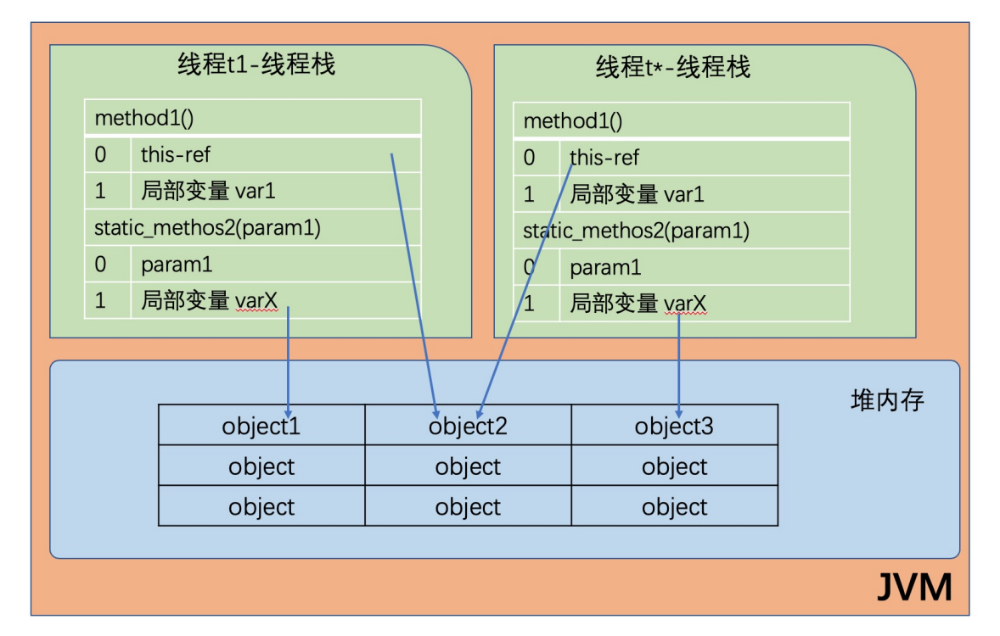
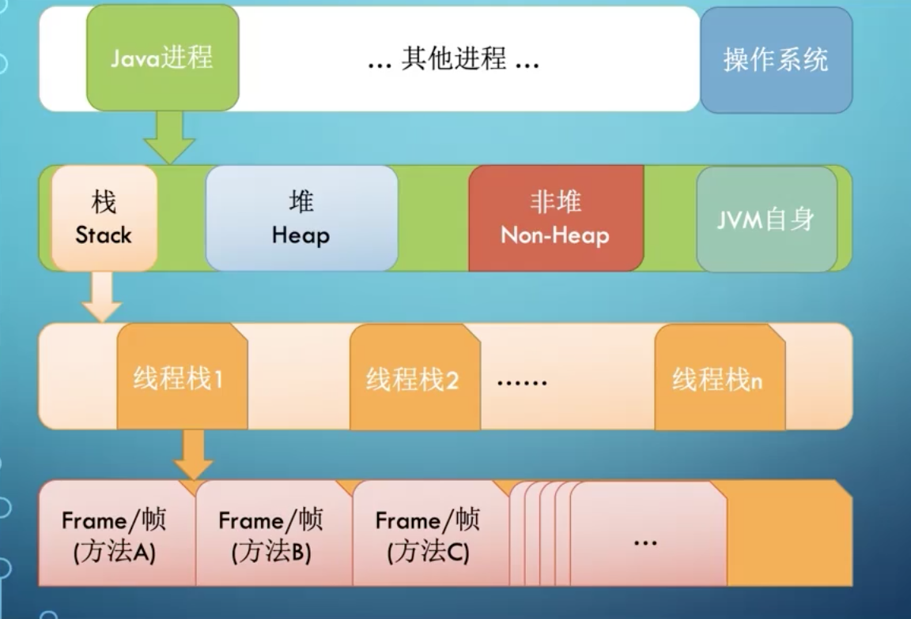
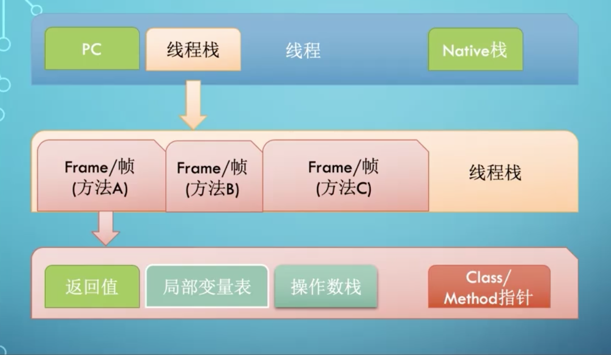
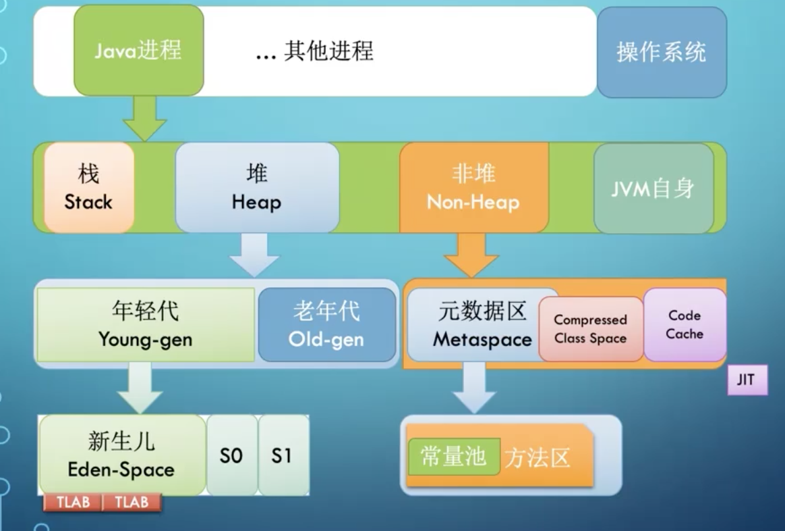

### JVM类加载器
类的生命周期
- 加载：找到class文件
- 链接
    - 验证：验证格式，依赖
    - 准备：静态字段、方法表
    - 解析：符号解析为引用
- 初始化：构造器、静态变量赋值、静态代码块
- 使用
- 卸载

类的加载时机
- 当虚拟机启动时，初始化用户指定的类，就是启动执行的main方法所在的类
- 当遇到用以新建目标类实例的new指令时，初始化new指令的目标类，就是new一个类的时候要初始化
- 当遇到调用静态方法的指令时，初始化静态方法所在类
- 当遇到访问静态字段的指令时，初始化静态字段所在类
- 子类的初始化会出发父类的初始化
- 如果一个接口定义类default方法，那么直接实现或者间接实现该接口的类的初始化，会触发该接口的初始化
- 使用反射API对某个类进行反射调用时，初始化这个类，其实跟前面一样，反射调用要么是已经有实例了，要么是静态方法，都需要初始化
- 当初次调用MethodHandle实例时，初始化该MethodHandle指向的方法所在类

类不会被初始化（可能会加载）
- 通过子类引用父类的静态字段，只会触发父类的初始化，而不会触发子类的初始化
- 定义对象数组，不会触发该类初始化
- 常量在编译期间会存入调用类的常量池，本质上并没有直接引用定义常量的类，不会触发定义常量所在的类
- 通过类名获取class对象，不会触发类的初始化，Hello.class不会让Hello类初始化
- 通过class.forName加载指定类时，如果指定参数initialize为false时，也不会触发类的初始化，其实这个参数是告诉虚拟机，是否要对类进行初始化。class.forName("jvm.Hello"),默认加载Hello类
- 通过ClassLoader默认的loadClass方法，也不会触发初始化动作（加载了，但是不会初始化）

类加载器
- 启动类加载器（BootstrapClassLoader）
- 扩展类加载器（ExtClassLoader）
- 应用类加载器（AppClassLoader）

加载器特点
- 双亲委托（加载某个类，先查探父类有没有已经加载，一直往上找，直到都没找到）
- 负责依赖
- 缓存加载

添加引用类几种方式
- 放到JDK的lib/ext下，或者-Djava.ext.dirs
- java --cp/classpath或者calss文件放到当前路径
- 自定义classLoader加载
- 拿到当前执行类的ClassLoader，反射调用addUrl方法添加Jar或者路径（JDK9无效）

### JVM内存模型
JVM内存结构
- 堆内存
- 线程
- 线程
- ...
每个线程只能访问自己的线程栈，每个线程都不能访问其他线程的局部变量，所有原先类型的局部变量都存在线程栈中
因此对其他线程是不可见的，线程可以将一个原生变量值的副本传给另一个线程，但是不能共享原生变量本身。堆内存
中包含javad代码中创建的所有对象，不管是哪个线程创建的。其中也包含包装类型。
**不管创建一个对象并将其赋值给局部变量，还是赋值给另一个对象的成员变量，创建的对象都会保存到堆内存**


JVM整体内存结构
- 每启动y一个线程，JVM就会在栈空间栈分配对应的线程栈，比如1MB的空间（-Xss1m），这边的内存是下图中的堆的内存，而不是整个程序的申请内存
- 线程栈也叫做java栈，如果使用了JNI方法，则会分配一个单独的本地方法栈
- 线程执行过程中，一般会有多个方法组成调用栈，比如A调用B，B调用C，每执行一个方法，就会创建对应的栈帧



JVM栈内存结构

- 栈帧是一个逻辑上概念，具体的大小在一个方法编写完成后基本上就能确定
- 比如返回值需要有一个空间存放，每个局部变量都需要对应的地址空间，此外还有给指令使用的操作栈，以及class指令（标识这个栈帧对应的哪个类的方法，指向非堆里面的class对象）

JVM堆内存结构

- 堆内存：是所有线程公用的内存空间，JVM将Heap内存分为年轻带和老年带两部分。
    - 年轻代还划分为3个内存池，新生代和存活代，在大部分GC算法中有两个存活区（S0，S1），在我们可以观察到的任何时刻，S0和S1总有一个是空的
      但一般较小，也不浪费多少空间
- Non-Heap：本质上还是Heap，只是一般不归GC管理，里面划分为3个内存池
    - Metaspace，以前叫持久代
    - CCS，Compressed Class Space，存放class信息，和Metaspace有交叉
    - Code Cache，存放JIT编译器编译后的本地机器代码
   
### JVM启动参数
```
java [options] classname [args]
java [options] -jar filename [args]
例子：
-server -Dfile.encoding=UTF-8 -Xmx8g -XX:+UseG1GC -XX:MaxPermSize=256m
```
- 以-开头为标准参数，所有JVM都要实现这些参数，并且向后兼容
- -D设置系统属性
- 以-X 开头的为非标准参数，基本都是传给JVM的，默认JVM实现这些参数功能，但是并不保证所有JVM实现都满足，
且不保证向后兼容。可以使用java -X命令来查看当前JVM支持的非标准参数
- 以-XX：开头为非稳定参数，专门用于控制JVM的行为，跟具体的JVM实现有关，随时可能会在下一个版本取消
- -XX: +-Flag形式，+-是对布尔值进行开关
- -XX: key=value 形式，指令某个选项的值

----
默认分类
- 系统属性参数
- 运行模式参数
- 堆内存参数
- GC设置参数
- 分析诊断参数
- JavaAgent参数
